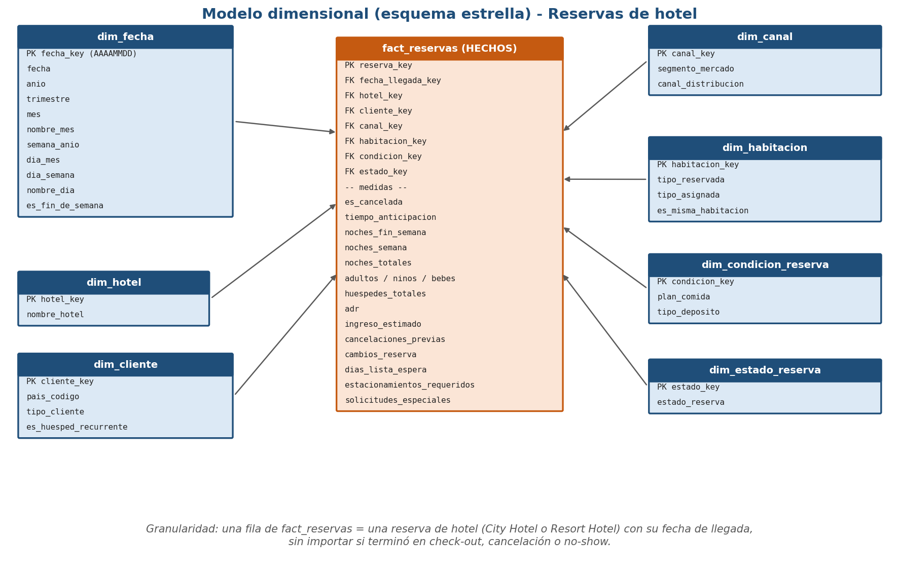
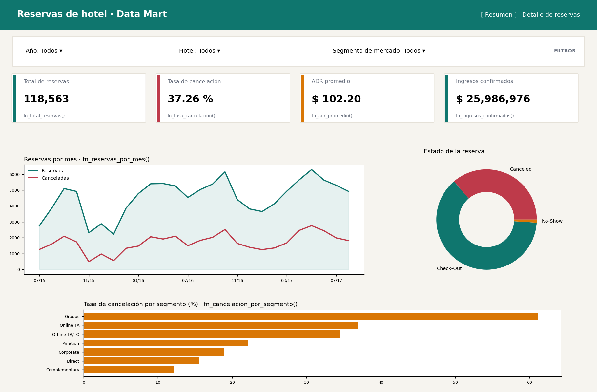

# Entregable 2 · Construcción del Data Mart
**Proyecto:** Mi primer dashboard — Reservas de hotel
**Dataset:** Hotel booking demand (Kaggle) · **Motor:** PostgreSQL 17 (Docker)

> Pregunta final de la fase: **¿Cómo voy a almacenar, consultar y presentar la información?**
> - **Almacenar:** en un modelo estrella en PostgreSQL (1 tabla de hechos + 7 dimensiones), cargado desde un CSV limpiado con Python.
> - **Consultar:** mediante una vista de detalle, una vista mensual y funciones SQL parametrizadas por los filtros del dashboard.
> - **Presentar:** en un dashboard con filtros, 4 tarjetas KPI, 2 gráficos y una tabla de detalle, cada uno enlazado a un objeto SQL (matriz de trazabilidad, sección 8).

---

## 1. Preparación y limpieza de datos

Script: `python/01_limpieza.py` · Evidencia: `docs/log_limpieza.txt`

| # | Transformación | Detalle | Justificación |
|---|---|---|---|
| 1 | Eliminar `company` y `agent` | 94.3 % y 13.7 % de nulos | Demasiado incompletas para aportar a los KPI |
| 2 | `children` nulo → 0 | 4 filas | Son pocas y 0 es el valor más razonable |
| 3 | `country` nulo → `UNK` | 488 filas | Se conserva la reserva con país desconocido |
| 4 | `meal` = Undefined → `SC` | 1,169 filas | La documentación del dataset indica que Undefined equivale a SC (sin plan) |
| 5 | `market_segment` / `distribution_channel` Undefined → Unknown | 2 y 5 filas | Unificar categoría desconocida |
| 6 | Eliminar reservas con 0 huéspedes | 180 filas | Registros no válidos |
| 7 | Eliminar reservas con 0 noches | 715 filas | No generan noches ni ingreso; distorsionan el ADR |
| 8 | Eliminar ADR negativo y atípico | 1 + 1 filas (ADR = -6.38 y 5,400) | Errores evidentes de captura |
| 9 | Construir `fecha_llegada` (DATE) | año + mes en texto + día | Permite la dimensión de tiempo |
| 10 | Renombrar columnas a español | 27 columnas finales | Consistencia con el modelo |
| 11 | **No** eliminar duplicados | 31,952 filas idénticas | No existe ID de reserva; no se puede distinguir un duplicado real de dos reservas distintas con las mismas características |

**Resultado:** 119,390 filas originales → **118,563 filas** limpias (827 eliminadas, 0.69 %).

## 2. Instalación y configuración de PostgreSQL

PostgreSQL 17 con Docker (`docker-compose.yml`): host `localhost`, puerto `5433` (el 5432 estaba ocupado por otro contenedor), base `bi_database`, usuario `bi_user`, contraseña `bi_password`. Se añadieron dos volúmenes de solo lectura (`./sql` y `./data`) para ejecutar los scripts y cargar el CSV desde dentro del contenedor.

```bash
docker compose up -d     # encender
docker compose down      # apagar
```

## 3. Modelo dimensional



### 3.1 Granularidad

> **Una fila de `fact_reservas` representa una reserva de hotel (City Hotel o Resort Hotel) con su fecha de llegada, sin importar si terminó en check-out, cancelación o no-show.**

### 3.2 Tabla de hechos: `fact_reservas`

| Tipo | Columnas |
|---|---|
| Clave primaria | `reserva_key` (sustituta, BIGSERIAL) |
| Claves foráneas | `fecha_llegada_key`, `hotel_key`, `cliente_key`, `canal_key`, `habitacion_key`, `condicion_key`, `estado_key` |
| Medidas aditivas | `noches_fin_semana`, `noches_semana`, `noches_totales`, `adultos`, `ninos`, `bebes`, `huespedes_totales`, `ingreso_estimado` (= `adr` × `noches_totales`), `es_cancelada` (0/1, sumable), `cambios_reserva`, `dias_lista_espera`, `estacionamientos_requeridos`, `solicitudes_especiales`, `cancelaciones_previas` |
| Medidas no aditivas | `adr` (tarifa por noche; se promedia ponderando por noches), `tiempo_anticipacion` (días) |

### 3.3 Dimensiones

| Dimensión | Clave | Atributos | Filas |
|---|---|---|---|
| `dim_fecha` | `fecha_key` (AAAAMMDD) | fecha, año, trimestre, mes, nombre del mes, semana, día, día de la semana, es fin de semana | 1,096 (2015–2017) |
| `dim_hotel` | `hotel_key` | nombre del hotel | 2 |
| `dim_cliente` | `cliente_key` | país, tipo de cliente, huésped recurrente | 442 |
| `dim_canal` | `canal_key` | segmento de mercado, canal de distribución | 26 |
| `dim_habitacion` | `habitacion_key` | tipo reservado, tipo asignado, es la misma habitación | 73 |
| `dim_condicion_reserva` | `condicion_key` | plan de comida, tipo de depósito | 11 |
| `dim_estado_reserva` | `estado_key` | estado (Check-Out, Canceled, No-Show) | 3 |

Las claves primarias y foráneas están declaradas en `sql/01_schema.sql`, junto con restricciones `CHECK` e índices sobre cada clave foránea.

## 4. Scripts de creación y carga

| Script | Función |
|---|---|
| `sql/01_schema.sql` | Crea staging, 7 dimensiones y la tabla de hechos |
| `sql/02_carga_staging.sql` | Carga `hotel_clean.csv` a `stg_reservas` (118,563 filas) |
| `sql/03_carga_dimensiones_hechos.sql` | Llena dimensiones (`SELECT DISTINCT`, `generate_series` para el calendario) y hechos (JOIN para obtener claves sustitutas) |
| `sql/04_validaciones.sql` | Consultas de validación |
| `sql/05_vistas_funciones.sql` | Vistas y funciones para el dashboard |

## 5. Evidencia de carga

| Tabla | Filas |
|---|---|
| `stg_reservas` | 118,563 |
| `dim_fecha` | 1,096 |
| `dim_hotel` | 2 |
| `dim_cliente` | 442 |
| `dim_canal` | 26 |
| `dim_habitacion` | 73 |
| `dim_condicion_reserva` | 11 |
| `dim_estado_reserva` | 3 |
| **`fact_reservas`** | **118,563** |

> Agrega aquí una captura de pantalla de tu propia ejecución (terminal o SQLTools) como evidencia.

## 6. Consultas de validación (`sql/04_validaciones.sql`)

Resultados completos en `docs/evidencia_validaciones.txt`.

| Validación | Qué comprueba | Resultado |
|---|---|---|
| V1.1 | Filas en staging = filas en hechos (118,563) | OK |
| V1.2 | Conteo de filas por tabla | Ver sección 5 |
| V2 | Hechos sin dimensión (huérfanos) en las 7 claves foráneas | 0 en todas · OK |
| V2.2 | Hoteles sin reservas | 0 · OK |
| V3 | Nulos en claves y medidas de la tabla de hechos | 0 · OK |
| V4.1 | Noches totales staging vs. hechos | 408,432 = 408,432 · OK |
| V4.2 | Reservas canceladas staging vs. hechos | 44,175 = 44,175 · OK |
| V4.3 | Ingreso estimado staging vs. hechos | 42,708,813.15 = 42,708,813.15 · OK |
| V4.4 | Medidas principales | 37.26 % cancelación · ADR 102.20 · ingresos confirmados 25,986,976.03 |
| V4.5 | Estado de la reserva coherente con `es_cancelada` | 0 inconsistencias · OK |

## 7. Vistas y funciones SQL (`sql/05_vistas_funciones.sql`)

Filtros comunes, todos opcionales (`NULL` = todos): `p_anio`, `p_hotel`, `p_segmento`.

| Objeto | Tipo | Descripción |
|---|---|---|
| `vw_reservas_detalle` | Vista | Hechos unidos a todas las dimensiones |
| `vw_kpi_mensual` | Vista | Reservas, cancelaciones, ADR e ingresos por año, mes y hotel |
| `fn_total_reservas()` | Función escalar | Total de reservas |
| `fn_tasa_cancelacion()` | Función escalar | Canceladas / total × 100 |
| `fn_adr_promedio()` | Función escalar | Ingresos confirmados / noches vendidas (solo no canceladas) |
| `fn_ingresos_confirmados()` | Función escalar | Suma de `adr × noches` de reservas no canceladas |
| `fn_reservas_por_mes()` | Función de tabla | Reservas, canceladas y % por año/mes |
| `fn_cancelacion_por_segmento()` | Función de tabla | Reservas, % cancelación e ingresos por segmento |
| `fn_detalle_reservas()` | Función de tabla | Detalle de reservas con filtros y límite |
| `fn_lista_segmentos()` | Función de tabla | Valores para el filtro de segmento |

## 8. Mockup del dashboard



Página interactiva: [`index.html`](../index.html) (se abre con doble clic; los filtros funcionan sobre un extracto de los datos reales).

**Organización general:** encabezado con navegación en dos vistas (*Resumen* / *Detalle de reservas*); barra de filtros (Año, Hotel, Segmento de mercado); 4 tarjetas KPI; vista Resumen con gráfico de líneas por mes, dona de estado y barras de cancelación por segmento; vista Detalle con la tabla de reservas.

**KPI definidos:**
1. **Tasa de cancelación** = reservas canceladas / total de reservas × 100.
2. **ADR (tarifa media por noche)** = ingresos confirmados / noches vendidas.
3. **Ingresos confirmados** = suma de `adr × noches` de las reservas no canceladas.
4. *(Complementario)* Total de reservas.

## 9. Matriz de trazabilidad: Mockup → KPI → Filtros → SQL

| Componente | Pregunta / KPI | Filtros | Origen de datos | Objeto SQL |
|---|---|---|---|---|
| Tarjeta 1 | ¿Qué porcentaje de reservas se cancela? | Año, Hotel, Segmento | `fact_reservas` + `dim_fecha`, `dim_hotel`, `dim_canal` | `fn_tasa_cancelacion()` |
| Tarjeta 2 | ¿Cuál es la tarifa media por noche (ADR)? | Año, Hotel, Segmento | `fact_reservas` + `dim_fecha`, `dim_hotel`, `dim_canal` | `fn_adr_promedio()` |
| Tarjeta 3 | ¿Cuántos ingresos generan las reservas confirmadas? | Año, Hotel, Segmento | `fact_reservas` + `dim_fecha`, `dim_hotel`, `dim_canal` | `fn_ingresos_confirmados()` |
| Tarjeta 4 | ¿Cuántas reservas hay en total? | Año, Hotel, Segmento | `fact_reservas` + dimensiones | `fn_total_reservas()` |
| Gráfico 1 (líneas) | ¿Cómo evolucionan las reservas y la cancelación mes a mes? | Año, Hotel, Segmento | `fact_reservas` + `dim_fecha`, `dim_hotel`, `dim_canal` | `fn_reservas_por_mes()` / `vw_kpi_mensual` |
| Gráfico 2 (barras horizontales) | ¿Qué segmentos de mercado cancelan más? | Año, Hotel | `fact_reservas` + `dim_canal`, `dim_fecha`, `dim_hotel` | `fn_cancelacion_por_segmento()` |
| Tabla de detalle | ¿Cuáles son las reservas individuales detrás de los KPI? | Año, Hotel, Segmento | `fact_reservas` + todas las dimensiones | `fn_detalle_reservas()` / `vw_reservas_detalle` |
| Dona (estado) | ¿Cómo terminan las reservas? | Año, Hotel, Segmento | `fact_reservas` + `dim_estado_reserva` | `vw_reservas_detalle` |
| Filtro Segmento | Lista de opciones del selector | — | `dim_canal` | `fn_lista_segmentos()` |

## 10. Uso de Inteligencia Artificial

Se utilizó IA generativa como apoyo para proponer el modelo dimensional y generar los borradores de los scripts de Python y SQL. El código fue ejecutado y probado contra PostgreSQL, y debe ser revisado y comprendido por la estudiante antes de la entrega.
